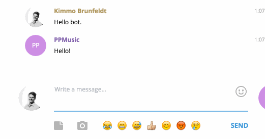

# ppmusicbot

> Telegram bot which adds all linked Spotify track links to a shared playlist.

 

 

**Features:**

* Add Spotify links to a playlist
* Convert Youtube links to Spotify tracks and add them to a playlist

## Get started

* `npm install`
* `cp .env.sample .env`
* Fill in the blank variables to `.env` file. **Don't** commit `.env` to version control.
* `npm start`
* Hubot is now running locally on your machine

## Release

* Make sure that you have Heroku app added as a git remote
* `git push heroku`
* Test that bot responds, send "Hello bot" to channel

## Setup a new bot

### Telegram bot

* Create bot https://core.telegram.org/bots
* Get access token

### Spotify Web API

* Create a new app https://developer.spotify.com/my-applications/#!/applications
* Follow [these examples](https://github.com/thelinmichael/spotify-web-api-node#authorization) to get client id, client secret and an initial refresh token.

### Youtube API

* Obtain a Youtube API v3 token https://developers.google.com/youtube/v3/getting-started

### Heroku

* Create a new Heroku app, e.g. `ppmusic`
* `heroku ps:scale web=0 telegram=1 -a ppmusic` Scale heroku dyno processes
* Provision add-ons. Redis is required.
* Setup needed environment variables, check .env.sample for reference.
* Do a [release](#release)

## Authors

* [Vesa Uimonen](https://github.com/vesauimonen)
* [Kimmo Brunfeldt](https://github.com/kimmobrunfeldt)
